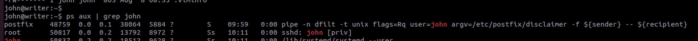

# smtp postfix

Postfix is an mail server \(with some bunch of extra features\) which runs on SMTP, it has the feature where is runs a script on sending every mail, like, if a mail goes through the SMTP server, it can add extra .stuff into the mail, like adding disclaimers, where the argv is the script it runs in the below example.



in this case it runs as the user john, so if we're able to modify the script file that runs on sending any mail through the postfix server, we can run anything we want as john. In this case, the file resided at /etc/postfix/disclaimer, and the configuration resided at /etc/postfix/master.cf.

```text
# this is from the postfix conf file, /etc/postfix/master.cf
dfilt     unix  -       n       n       -       -       pipe
  flags=Rq user=john argv=/etc/postfix/disclaimer -f ${sender} -- ${recipient}
```

```text
# we can use the below simple script for testing the mail functionality
import smtplib
import sys

sender = sys.argv[1]
receivers = [sys.argv[2]]

message = """From: From Person <kyjhnle@writer.htb>
To: To Person <johnnnn@writer.htb>
Subject: SMTP e-mail test

This is a test e-mail message.
"""

try:
    smtpObj = smtplib.SMTP('localhost')
    smtpObj.sendmail(sender, receivers, message)
    print ("Successfully sent email")
except SMTPException:
    print ("Error: unable to send email")
```

refer here for more info on configuring postfix:  
[https://www.hackingarticles.in/smtp-pentest-lab-setup-ubuntu/](https://www.hackingarticles.in/smtp-pentest-lab-setup-ubuntu/)  
[https://www.howtoforge.com/how-to-automatically-add-a-disclaimer-to-outgoing-emails-with-altermime-postfix-on-debian-squeeze](https://www.howtoforge.com/how-to-automatically-add-a-disclaimer-to-outgoing-emails-with-altermime-postfix-on-debian-squeeze),

